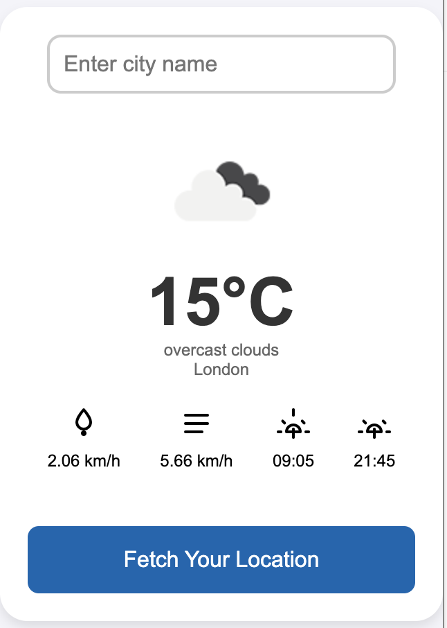

# Chrome Weather Extension 


This is a simple and lightweight Chrome extension that provides real-time weather updates for your current location. The extension fetches weather data from an external API and displays it conveniently within your browser.




## Features

- Real-time weather information based on your location
- Displays temperature, humidity, wind speed, and weather condition
- User-friendly interface with minimal design
- Customizable location input (optional)

## Installation

### Install from Source

1. Clone this repository to your local machine:

   ```bash
   git clone https://github.com/majidfeiz/chrome-weather-extension.git
   ```
2. Open Chrome and go to chrome://extensions/.
3. Enable Developer mode by toggling the switch in the top-right corner.
4. Click Load unpacked and select the folder where you cloned the repository.

The extension will now appear in your Chrome extensions bar.


## Usage

1. After installing the extension, click the weather icon in the Chrome toolbar to open the weather window.
2. The extension will request access to your location. Grant access to get weather data based on your current location.
3. The weather information will display, including temperature, wind speed, and other relevant details.
4. Optionally, you can manually enter a city name in the input field if you wish to see the weather for a different location.

## Permissions
This extension requires the following permissions:

1. Geolocation: To get weather updates based on your current location.
2. Storage: To save user preferences like selected location.


## Contributing

Feel free to fork the repository and submit pull requests. Any contributions are welcome!

1. Fork the project.
2. Create your feature branch: git checkout -b feature/my-new-feature.
3. Commit your changes: git commit -m 'Add some feature'.
4. Push to the branch: git push origin feature/my-new-feature.
5. Submit a pull request.

